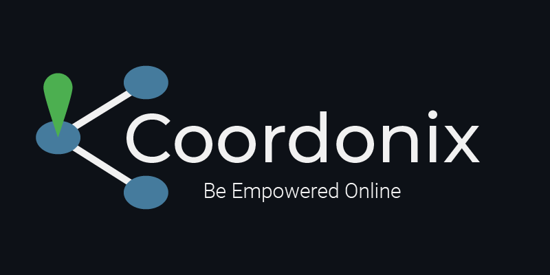

## 👤 About Coordonix

Welcome to **Coordonix's GitHub Profile**, your gateway to a world of open-source innovation and collaboration.

### Our Mission

We are committed to making open-source software accessible, simple, and empowering for users at all levels. Through comprehensive guides, reviews, and valuable resources, we equip individuals and businesses to harness the full potential of open-source solutions, enabling cost-effective, customizable, and flexible tech choices.

### Our Vision

To empower a global community where open-source software becomes the go-to solution for innovation, creativity, and collaboration. We aim to create a future where anyone, regardless of resources, can leverage customizable technology to shape the world around them.

This profile will serve as a hub for our projects, tutorials, and tools designed to empower users. Whether you're a developer, entreprenuer, or tech enthusiast, there's something here for you!

## 📈 GitHub Stats

## 🌟 Featured Repos

## 💻 Tech Stack

Here's a glimpse of the technologies that we use and love:

 -->

## 🔗 Connect with Us

